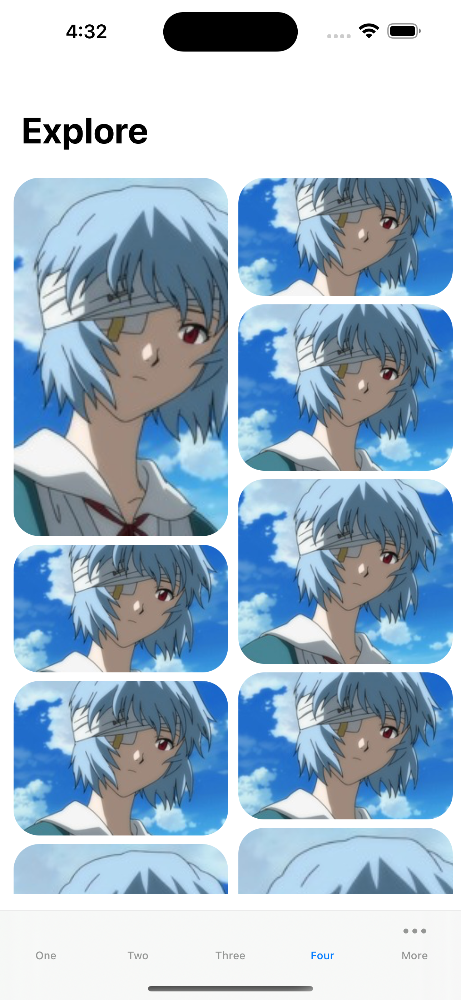

# IOS Application Clone

## Description

I am trying to clone some IOS application to learn how to build IOS application.

## Demo

1. Call 師傅 [App Store](https://apps.apple.com/hk/app/call-shi-fu-yong-hu-ban/id943297218?l=zh)

     

2. Pocket [App Store](https://apps.apple.com/tw/app/pocket/id309601447) 

    

3. Spotify [App Store](https://apps.apple.com/us/app/spotify-discover-new-music/id324684580)

    

4. Clubhouse [App Store](https://apps.apple.com/us/app/clubhouse-drop-in-audio-chat/id1503133294)

    

5. DesignCode [Youtube](https://www.youtube.com/watch?v=XzjxqS0xAu0)

        