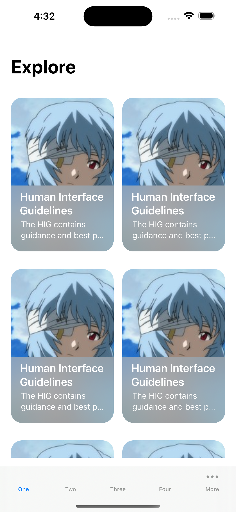

# IOS Application Clone

[latest update](./mcl-cinemas/update.md)

## Description

I am trying to clone some IOS application to learn how to build IOS application.

## Demo

<table>
<tr>
<td>

[MCL Cinemas](https://apps.apple.com/hk/app/mcl-cinemas-ticketing/id807365065?l=en-GB)

</td>

<td>

[Spotify](https://apps.apple.com/us/app/spotify-discover-new-music/id324684580)

</td>

</tr>

<tr>

<td>

[TamJai SamGor](https://apps.apple.com/hk/app/%E8%AD%9A%E4%BB%94%E4%B8%89%E5%93%A5%E7%B1%B3%E7%B7%9A-tamjai-samgor-mixian/id1623985775?l=en)

</td>

<td>

[Call 師傅](https://apps.apple.com/hk/app/call-shi-fu-yong-hu-ban/id943297218?l=zh)

</td>

</tr>

<tr>
<td>

[Pocket](https://apps.apple.com/tw/app/pocket/id309601447)

</td>

<td>

[Clubhouse](https://apps.apple.com/us/app/clubhouse-drop-in-audio-chat/id1503133294)

</td>
</tr>

</table>

DesignCode [Youtube](https://www.youtube.com/watch?v=XzjxqS0xAu0)

     
